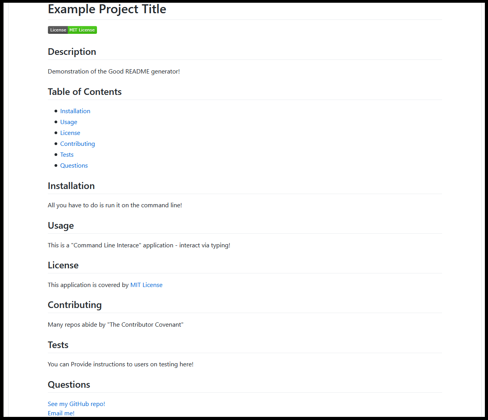

# Good README Generator
  
    
Command-line application that dynamically generates a high-quality README.md based on user input.

---

## Table of Contents
  
* [User Story](#User-Story)
* [Usage](#Usage)
* [App in Action](#App-in-Action)
* [Example README](#Example-README)
* [Contents](#Contents)
* [Author](#Author)
* [License](#License)
  
---

## User Story
>AS A developer  
>I WANT a README generator  
>SO THAT can quickly create a professional README for a new project  

---

## Usage 
  
This is a "Command Line Interace" application running in a Node.js runtime environment.

---

## App in Action

## Example README

---

## Contents
**Files include:**
* Index JS page
* Sample Screenshot of App 
* App Demo GIF
* Utilities
* Sample README
* Node.js JSON Packages
* This README file

---

## Author
Abraham Spindel  

---

## License
* [Node.js Project Licensing](https://raw.githubusercontent.com/nodejs/node/master/LICENSE) 
* Node Package Manager (npm) [Artistic License 2.0](https://www.npmjs.com/policies/npm-license)
* npm Inquirer: Copyright (c) 2016 Simon Boudrias (twitter: @vaxilart) Licensed under the [MIT license](https://choosealicense.com/licenses/mit/).

